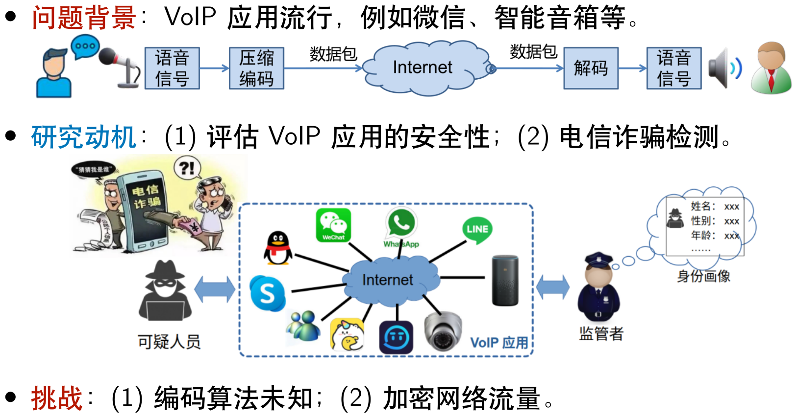
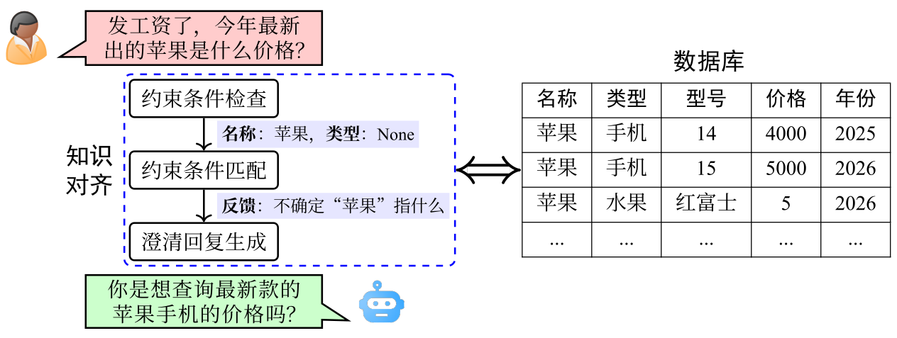
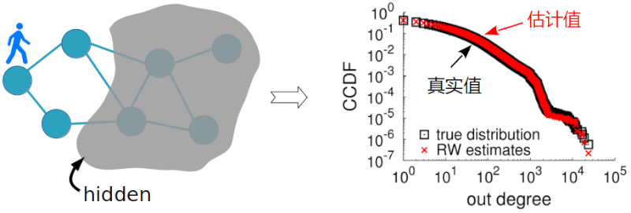
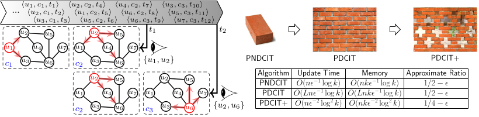

# -*- fill-column: 80; -*-
#+TITLE: Research
#+URI: /research/
#+LANGUAGE: zh_cn
#+OPTIONS: toc:2

* 数据安全与隐私保护

#+BEGIN_QUOTE
The only truly secure system is one that is powered off, cast in a block of
concrete and sealed in a lead-lined room with armed guards.
#+END_QUOTE

** VoIP 加密网络流量识别
随着智能手机等移动终端的迅速普及，以微信电话为代表的互联网语音（Voice over
Internet Protocol, VoIP）应用日益流行。VoIP 应用在开放的互联网中传递涉及用户隐私
的语音内容，保护用户数据安全至关重要。尽管 VoIP 应用普遍采用私有语音编码算法、加
密通信等手段保障数据安全，但是 VoIP 加密流量的传输模式仍有可能泄露用户性别、用户
身份，甚至通话内容等敏感信息，存在隐私泄露风险。我们测量分析了四种 VoIP 应用的加
密流量传输模式与用户性别、通话内容等方面的关联关系，发现语音频率与数据包长存在明
显的相关性，并基于该发现设计了一种语音频谱与数据包长对齐的 VoIP 加密流量识别方
法——VPrint。研究结果表明微信等流行 VoIP 应用普遍存在安全隐患，并建议相关厂商采取
措施提升安全性，避免造成用户隐私数据泄露。

#+CAPTION: VoIP 应用流行
#+ATTR_HTML: :width 600px

** 密码学与隐私计算
保障用户隐私与数据安全日益受到重视。数据拥有方的数据往往涉及机密、隐私等，不愿意
公开分享与流通（例如，银行账户间的转账记录等），但是不同数据拥有方又存在相互合作
的意愿（例如，不同银行希望合作以更好的评估个人或企业的信贷风险），如何在不泄漏数
据拥有方数据隐私的情况下实现不同数据方的协同计算，是隐私计算的重要研究内容。隐私
计算的基础是密码学。密码学用数学硬度构筑不可逾越的边界，确保数据传输与存储的机密
性；隐私计算则在数据"可用但不可见"的悖论中寻求解决方法，让数据在密态下完成价值流
转。

#+CAPTION: 安全多方计算示意
#+ATTR_HTML: :width 700px

** 大模型与智能体安全
当大模型从"对话工具"进化为能操作数据库、调用 API、自主决策的智能体时，安全已从锦
上添花的议题变为不可回避的根基性命题。大模型幻觉问题在金融、医疗、法律等高风险领
域可能由看似合理的虚构输出导致实质性决策失误，单纯通过增加模型规模并不能消除这一
固有缺陷，必须从推理机制、知识溯源、事实校准等层面寻求突破。训练语料中的隐私与商
业秘密在推理时可能被无意复现，提示注入攻击更可在运行时绕过对齐防线，这意味着传统
"信任但验证"的模式已不适用，必须建立训练前净化、推理时隔离、输出后审计的全链路防
护。智能体安全将前两者的风险放大了指数级：带工具的智能体不仅会"说错话"，更会"做
错事"。间接提示注入、权限提升、工具误用等攻击面完全是新范式下的新问题，现有安全
框架几乎无法覆盖。大模型与智能体安全研究不在于消灭所有风险，而在于为 AI 系统构建
可度量、可审计、可回滚的信任边界，让智能体在真正落地之前先学会对自己的行为负责。

#+CAPTION: 通过知识对齐抑制幻觉
#+ATTR_HTML: :width 700px

* 大数据近似计算与优化
#+BEGIN_QUOTE
Algorithms + Data Structures = Programs

Algorithm: A word used by programmers when they don't want to explain what they
did.
#+END_QUOTE

** 大规模图数据采样测量方法
研究者作为第三方通常不拥有图数据，例如 Facebook 的好友网络被 Facebook 拥有，基于
用户隐私和商业机密的考虑，Facebook 等数据拥有方并不愿意共享数据给第三方。在这种
情况下，第三方只能利用图数据拥有者提供的 API 接口访问图数据，但是 API 往往会通过
限制调用总次数或调用频率等手段使第三方无法获得完整图数据。为了分析图数据的结构特
征，第三方通常只能用采样的方法采样得到一些节点和边作为样本，利用这些少量样本估计
图的整体结构特征，例如通常使用的节点采样或随机游走等策略。

#+CAPTION: 基于随机游走的大图采样方法
#+ATTR_HTML: :width 700px

** 流式数据实时处理与在线优化
网络流量等流式数据中普遍存在 Heavy Hitter、大象流、持续流等现象，与网络扫描行为、
DDoS 攻击行为、APT 攻击行为等息息相关，所以实时发现高速流式数据中的 Heavy Hitter、
大象流、持续流是流式数据处理中的重要研究内容。由于这些处理算法往往需要部署在交换
机、路由器、IoT 设备、边缘设备等资源受限设备中，因此对算法的计算复杂度、内存占用
等提出特别高的要求，需要设计轻量级、高效率的面向高速数据流的快速筛选方法。此外，
识别图中最有影响力的节点在很多实际问题中都有应用，例如在线广告投放、病毒营销等。
目前的工作大都假设网络结构固定不变，但实际中网络结构可能在不断发生变化，导致昨天
识别的一组最有影响力节点在今天不一定仍然有影响力。需要设计一种动态图数据流上的最
优节点识别算法。

#+CAPTION: 一种动态图流中最有影响力节点发现与跟踪方法

